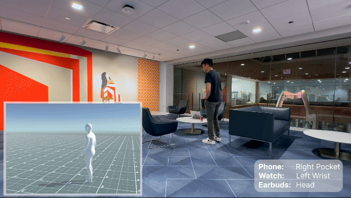

# MobilePoser: Real-Time Full-Body Pose Estimation and 3D Human Translation from IMUs in Mobile Consumer Devices
Author's implementation of the paper [MobilePoser: Real-Time Full-Body Pose Estimation and 3D Human Translation from IMUs in Mobile Consumer Devices](https://dl.acm.org/doi/pdf/10.1145/3654777.3676461). This work was published at UIST'24.

<br>
<div align="center">

</div>
<br>

## Installation 
We recommend configuring the project inside an Anaconda environment. We have tested everything using [Anaconda](https://docs.anaconda.com/anaconda/install/) version 23.9.0 and Python 3.9. The first step is to create a virtual environment, as shown below (named `mobileposer`).
```
conda create -n mobileposer python=3.9
```
You should then activate the environment as shown below. All following operations must be completed within the virtual environment.
```
conda activate mobileposer
```
Then, install the required packages.
```
pip install -r requirements.txt
```
You will then need to install the local mobileposer package for development via the command below. You must run this from the root directory (e.g., where setup.py is).
```
pip install -e .
```

## Process Datasets

### Download Training Data
1. Register and download the AMASS dataset from [here](https://amass.is.tue.mpg.de/). We use 'SMPLH+G' for each dataset. 
2. Register and download the DIP-IMU dataset from [here](https://dip.is.tuebingen.mpg.de/). Download the raw (unormalized) data.
3. Request access to the TotalCapture dataset [here](https://cvssp.org/data/totalcapture/). Download Vicon Groundtruth in the raw folder, and IMU data in the IMU folder. 
4. Download the IMUPoser dataset from [here](https://github.com/FIGLAB/IMUPoser).

Once downloaded, your directory might appear as follows:
```bash
data
└── raw
    ├── AMASS
    │   ├── ACCAD
    │   ├── BioMotionLab_NTroje
    │   ├── BMLhandball
    │   ├── ...
    │   └── Transitions_mocap
    ├── DIP_IMU
    │   ├── s_01
    │   ├── s_02
    │   ├── s_03
    │   ├── ...
    │   └── s_10
    ├── IMUPoser
    │   ├── P1
    │   ├── P2
    │   ├── P3
    │   ├── ...
    │   └── P10
    └── TotalCapture/
            ├── IMU/
            │   ├── s1_acting1.pkl
            │   ├── ...
            └── raw/
                ├── S1/
                │   ├── acting1/
                │   │   ├── gt_skel_gbl_ori.txt
                │   │   ├── gt_skel_gbl_pos.txt
                │   ├── ...
```

### Setup Training Data 
In `config.py`: 
- Set `paths.processed_datasets` to the directory containing the pre-processed datasets.
- Set `paths.raw_amass` to the directory containing the AMASS dataset.
- Set `paths.raw_dip` to the directory containing the DIP dataset.
- Set `paths.raw_imuposer` to the directory containing the IMUPoser dataset.
  
The script `process.py` drives the dataset pre-processing. This script takes the following parameters:
1. `--dataset`: Dataset to pre-process (`amass`, `dip`, `imuposer`). Defaults to `amass`.

As an example, the following command will pre-process the DIP dataset. 
```
$ python process.py --dataset dip
```

### 关于数据处理的说明（中文）

#### 什么是 IMU 合成，为什么需要它？

训练 IMU→姿态模型需要大量"IMU 信号 + 准确姿态"的配对数据。真实采集成本极高（需同时穿戴 IMU 和光学动捕），DIP-IMU 数据集花费巨大代价才采集到 330K 帧，远不够训练深度网络。

`process.py --dataset amass` 做的事情就是 **IMU 合成**：AMASS 包含数百万帧光学动捕的骨骼姿态，`process.py` 用物理公式从这些真实姿态反推出"如果那里绑了个 IMU 会读到什么数据"：

```
AMASS 骨骼姿态 θ_t
    ↓  SMPL 正向运动学
各关节的 3D 位置和旋转矩阵
    ↓
orientation：取骨骼段旋转矩阵  →  模拟 IMU 姿态读数
acceleration：顶点位置二阶差分  →  模拟 IMU 加速度读数
    ↓
(合成 IMU 信号, 真实姿态 θ_t) 配对数据  →  用于训练
```

合成 IMU 信号是数学计算而非估计，从高精度光学动捕姿态推算出来的信号理论上与真实传感器一致。

#### 合成数据与真实 IMU 的域差异（Sim-to-Real Gap）

合成数据与真实 IMU 之间存在一定差异：

| 合成数据的假设 | 真实传感器的实际情况 |
|-------------|-----------------|
| 传感器与骨骼完全刚性绑定 | 存在皮肤软组织晃动 |
| 无传感器噪声 | 有加速度计/陀螺仪噪声 |
| 全局坐标系理想对齐 | 穿戴角度每次略有不同 |

这就是为什么训练完成后还需要用 DIP-IMU 的 s01–s08 做 finetune——用少量真实数据弥合这个差距。

#### DIP-IMU 数据集的用途

| 数据 | 用途 |
|------|------|
| s01–s08 | 可选：在真实 IMU 数据上 finetune，提升真实场景精度 |
| s09–s10 | 必须：标准测试集，用于评估并与文献数字对比 |

#### 处理顺序建议

```bash
# 第一步：处理 AMASS 生成训练数据（必须，耗时约数小时）
python -m mobileposer.process --dataset amass

# 第二步：处理 DIP-IMU 生成测试/finetune 数据（需先下载 DIP-IMU raw 数据）
python -m mobileposer.process --dataset dip
```

## Training Models 
The script `train.py` drives the training process. This script takes the following parameters:
1. `--module`: Train an individual module (`poser`, `joints`, `foot_contact`, `velocity`). Default to training all modules. 
2. `--init-from`: Initialize training from an existing checkpoint. Defaults to training from scratch. 
3. `--finetune`: Specify dataset for finetuning module (e.g., `dip`). 
4. `--fast-dev-run`: A boolean flag that caps the execution to a single epoch. This flag is useful for debugging.

As an example, we can execute the following command to train all modules: 
```
$ python train.py
```

### Finetuning Model
To facilitate finetuning MobilePoser, we provide a script `finetune.sh`. To run this script, use the following syntax: 
```
$ ./finetune.sh <dataset-name> <checkpoint-directory>
```

### Prepare Model
The script `combine_weights.py` combines the weights of individual modules into a single weight file that can be loaded into `MobilePoserNet`. 
To run this script, use the following syntax: 
```
$ python combine_weights.py --finetune <dataset-name> --checkpoint <checkpoint-directory>
```
Omit the `--finetune` argument if you did not finetune. The resulting weight file will be stored under the same directory as the `checkpoint-directory>`


### Download pre-trained network weights
We provide a pre-trained model for the set of configurations listed in `config.py`. 
1. Download weights from [here](https://uchicago.box.com/s/05bany9ubfcl06pfwyy9lm2tk9fa9iqx). 
2. In `config.py`, set the `paths.weights_file` to the model path.

### Run Evaluation
The script `evaluate.py` drives model evaluation. This script takes the following arguments. 
1. `--model`: Path to the trained model.
2. `--dataset`: Dataset to execute testing on (e.g., `dip`, `imuposer`, `totalcapture`).
   
As an example, we can execute the following concrete command:
```
$ python evaluate.py --model checkpoints/weights.pth --dataset dip
```

### Visualizing Results 
To visualize the prediction results of the trained model, we provide a script `example.py`. This script takes the following arguments. 
1. `--model`: Path to the trained model.
2. `--dataset`: Dataset to execute prediction for visualization. Defaults to `dip`.
3. `--seq-num`: Sequence nuber of dataset to execute prediction. Defaults to 1.
4. `--with-tran`: A boolean flag to enable visualizing translation estimation. Defaults to False. 
5. `--combo`: Device-location combination. Defaults to 'lw_rp' (left-wrist right-pocket).
   
Additionally, you can set the GT environment variable to customize visualization modes:
- GT=1: Visualizes both predictions and ground-truth.
- GT=2: Visualizes only the ground-truth data.

As an example, we can execute the following concrete command:
```
$ GT=1 python example.py --model checkpoints/weights.pth --dataset dip --seq-num 5 --with-tran
```

Note, we recommend using your local machine to visualize the results. 

## Citation 
```
@inproceedings{xu2024mobileposer,
  title={MobilePoser: Real-Time Full-Body Pose Estimation and 3D Human Translation from IMUs in Mobile Consumer Devices},
  author={Xu, Vasco and Gao, Chenfeng and Hoffmann, Henry and Ahuja, Karan},
  booktitle={Proceedings of the 37th Annual ACM Symposium on User Interface Software and Technology},
  pages={1--11},
  year={2024}
}
```

## Contact
For questions, please contact nu.spicelab@gmail.com.

## Acknowledgements 
We would like to thank the following projects for great prior work that inspired us: [TransPose](https://github.com/Xinyu-Yi/TransPose), [PIP](https://xinyu-yi.github.io/PIP/), [IMUPoser](https://github.com/FIGLAB/IMUPoser). 

## License 
This work is licensed under the Creative Commons Attribution-NonCommercial-ShareAlike 4.0 International License. For commercial use, a separate commercial license is required. Please contact kahuja@northwestern.edu at Northwestern University for licensing inquiries.
