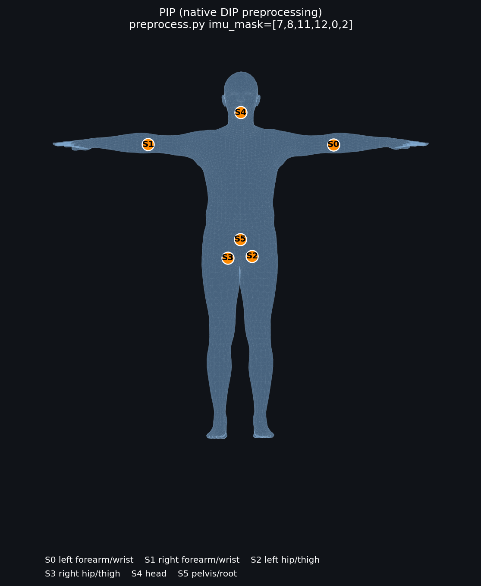
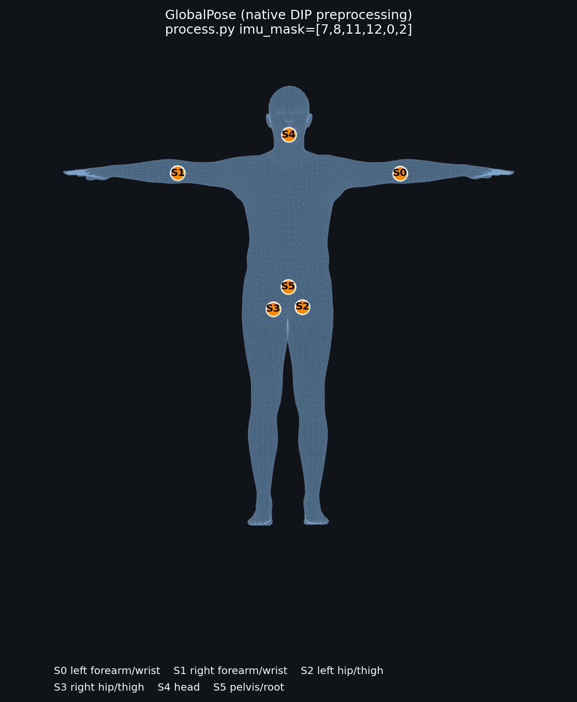
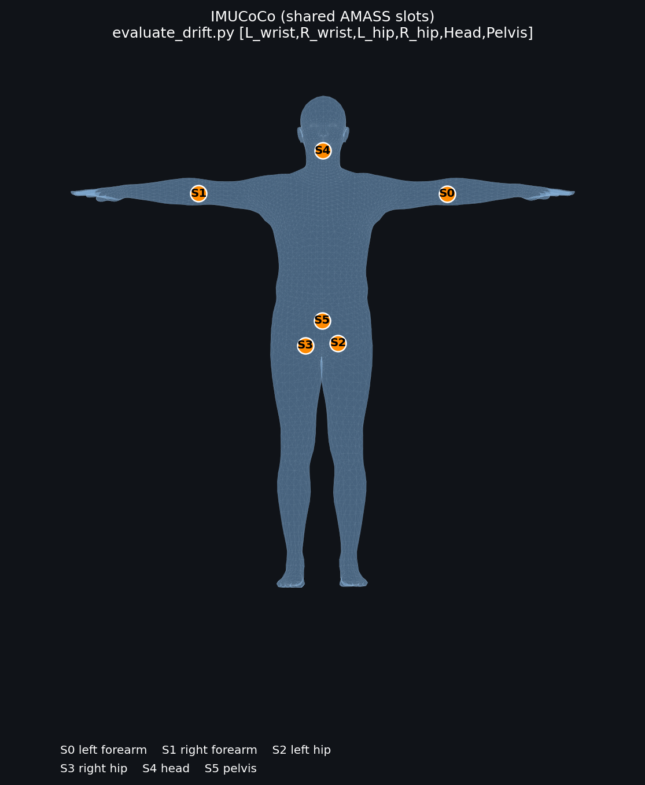
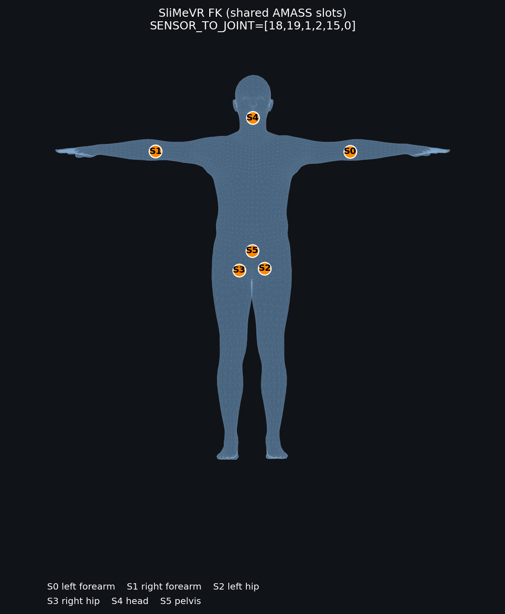
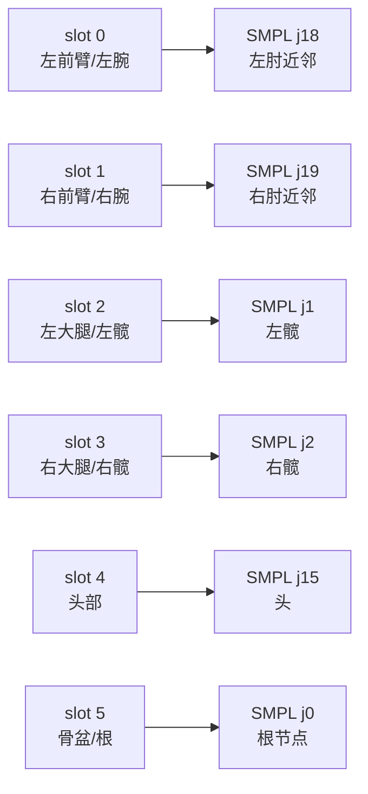

# 多方法 IMU 人体姿态重建基准分析报告

**数据根目录**：`benchmark_results/`  
**报告依据**：`standard_metrics.json`、`detailed_metrics.jsonl`、
`detailed_metrics_manifest.json`、`benchmark_report.json` 以及保存的
`stdout.log`/`stderr.log`。  
**更新时间**：2026-09-12

## 1. 结论摘要

本轮覆盖 GlobalPose、IMUCoCo、MobilePoser、PIP、PNP、SliMeVR、TransPose 七种方法。DIP 统一结果包含 2,799 个有效帧；AMASS drift
使用 618 个序列、最长 120 s 的 3,600 帧时间窗。

1. **DIP 旋转精度**：TransPose 为 19.58°，MobilePoser 六物理 IMU 配置为
   20.62°；MobilePoser 五物理 IMU 配置为 21.03°，只比 TransPose 高 1.45°。
   PIP 的残留均值为 20.04°；它保留为成功序列诊断结果，同时报告 1/6 的 QP
   失败率，因此不进入无条件排名。
2. **drift 旋转精度**：PIP 的成功序列残留均值最低（13.27°），但 104/618 序列失败；
   在逐序列零失败的方法中，TransPose（19.35°）和 MobilePoser 六物理 IMU
   （20.07°）最好。MobilePoser 的 4/5/6 传感器曲线都已生成且逐序列零失败；
   其缺少的只是 runner 元数据，不需要为数值指标重复计算。
3. **根平移是 MobilePoser 的主要短板**：DIP 为 2.266 m，drift 为
   12.766 m；TransPose 分别为 0.568 m 和 1.421 m。姿态角度接近不代表全局
   位移可靠，行走、起身、躺下和接触动作应单独报告平移误差。
4. **PIP 失败不是随机的单个异常**：drift 的失败原因统一为
   `RuntimeError: PIP QP solve failed: cvxopt: invalid QP solution`，在
   interaction、running、jumping 等动作中较集中。其成功序列均值只能作为
   诊断参考，不能与零失败方法作无条件优劣结论。
5. **PNP drift 已补全**：当前 618/618 序列成功、失败数为 0，标准指标和逐序列
   JSONL 均已生成。全身旋转误差为 24.35°、腰部为 14.92°、根平移为 1.958 m，
   已具备进入完整结果比较的条件。
6. **移动端证据仍不完整**：当前没有参数量、FP16/INT8 文件大小、CPU 单帧
   延迟、峰值 RAM 或能耗记录，因此目前只能讨论精度和端到端运行时间，不能宣称
   已满足移动端部署指标。

## 2. 传感器协议与实现对应关系

### 2.1 本项目统一桥接协议

所有进入 `benchmark_results` 的六 IMU 方法都被转换到同一槽位顺序。这里的
“关节”是佩戴位置的 SMPL 近邻代理，不代表传感器真的安装在关节旋转中心：

下列图片均基于仓库中 `code/PNP/models/SMPL_male.pkl` 的真实 SMPL 模板网格，采用正面二维投影，
橙色点由 `J_regressor` 计算得到。每张图的标题同时记录了实际采用的代码来源，
避免把原始 DIP 索引和 benchmark bridge 槽位混为一谈。

| 方法 | SMPL 网格上的传感器布局 |
|---|---|
| MobilePoser |  |
| PIP |  |
| PNP |  |
| TransPose |  |
| GlobalPose |  |
| IMUCoCo |  |
| SliMeVR FK |  |

图 1：各方法的 SMPL 传感器布局。PIP、PNP、TransPose、GlobalPose 的原生 DIP
预处理按 `imu_mask=[7,8,11,12,0,2]` 并依据各自评估器的 `lw,rw,lp,rp,hd,root`
标签画出（左右前臂、左右髋/大腿、头、骨盆）；IMUCoCo、SliMeVR 和 MobilePoser
按各自评测代码的共享槽位/关节映射画出。对于最终跨方法数值比较，仍以统一
bridge 后的六槽位数据为准。



| 统一槽位 | 身体佩戴位置 | 代码中的 SMPL 代理 | 评测中是否必需 |
|---:|---|---:|---|
| 0 | 左前臂/左腕 | j18（左肘近邻） | 六传感器方法必需；MobilePoser 可屏蔽 |
| 1 | 右前臂/右腕 | j19（右肘近邻） | 六传感器方法必需；MobilePoser 可屏蔽 |
| 2 | 左大腿/左髋 | j1 | 六传感器方法必需；MobilePoser 可屏蔽 |
| 3 | 右大腿/右髋 | j2 | 六传感器方法必需；MobilePoser 可屏蔽 |
| 4 | 头部 | j15 | 六传感器方法必需；MobilePoser 的 sweep 可屏蔽 |
| 5 | 骨盆/根 | j0 | 统一协议中的根参考；MobilePoser 的物理计数始终包含它 |

### 2.2 各方法代码中的传感器位置

| 方法 | 论文/原始代码描述 | 本项目桥接后的配置 | 需要特别注意的实现事实 |
|---|---|---|---|
| MobilePoser | 左右前臂、左右下肢、头、骨盆 | `[0,1,2,3,4,5]`；4/5/6 IMU 分别保留 3/4/5 个学习槽加 slot 5 | 网络输入固定 5 个可学习槽；物理 IMU 数不能写成网络输入维度 |
| TransPose | 原始 DIP 代码 `imu_mask=[7,8,11,12,0,2]`，标签为 `lw,rw,lp,rp,hd,root` | 左右前臂、左右髋/大腿、头、骨盆 | 代码注释中的 `lw/rw/lp/rp` 是协议标签；桥接数据使用统一槽位 |
| PIP | `preprocess.py` 使用同一 `imu_mask`；评估器标签为左/右腕、左/右髋、头、root | 左右前臂、左右髋/大腿、头、骨盆 | PIP 另外进行骨盆相对归一化和物理 QP；失败记录必须保留 |
| PNP | `process.py` 使用同一 `imu_mask`；`evaluate_dip.py` 明确写明 `lw,rw,lp,rp,hd,root` | 左右前臂、左右髋/大腿、头、骨盆 | 固定六传感器，不支持公平的少传感器消融 |
| GlobalPose | `process.py` 同一 `imu_mask`；原生输入还包含姿态、加速度和角速度转换 | 左右前臂、左右髋/大腿、头、骨盆 | bridge 版本从共享 `acc/ori` 数值微分角速度；不是原生传感器日志格式 |
| IMUCoCo | `evaluate_drift.py` 明确写为 `[L_wrist,R_wrist,L_hip,R_hip,Head,Pelvis]` | 左右前臂、左右髋/大腿、头、骨盆 | 支持组合消融，但本报告主表使用 full-6 配置 |
| SliMeVR FK | 评估器将传感器姿态直接赋给仪器化身体部位，骨盆隐式保留 | 左右前臂、左右髋/大腿、头、骨盆 | 是几何 FK 下界，不输出可比的根平移估计 |

因此，表中的“6 IMU”表示六个物理佩戴点，而不是所有网络都接收相同的张量
维度。尤其 MobilePoser 的 `6s = 5 个学习槽 + 1 个骨盆参考`，不能与 PIP、PNP
的六个显式输入槽直接按网络宽度比较。

### 2.3 结果图索引

drift 目录中已经生成了可直接用于报告的图：

| 图 | 用途 | 文件 |
|---|---|---|
| 图 1 | 随时间的旋转漂移 | `benchmark_results/<method>/drift/fig1_drift_timeseries.png` |
| 图 2 | 组合/传感器配置比较 | `benchmark_results/<method>/drift/fig2_combo_comparison.png` |
| 图 3 | 传感器数量与腰部误差 | `benchmark_results/<method>/drift/fig3_sensor_count_vs_lumbar.png` |
| 图 4 | 根平移漂移 | `benchmark_results/<method>/drift/fig4_translation_drift.png` |

建议论文或汇报中至少并排放置 MobilePoser 的图 1、图 3、图 4，以及 PNP、
TransPose 的图 1；这样能同时呈现传感器数量、姿态随时间变化和根平移发散。

## 3. 完整性门禁

逐序列清单中，`record_count` 是尝试的序列数，`failed_sequences` 是有明确
失败原因的记录。`benchmark_report.json` 缺失或状态非 `passed` 时，结果不具备
论文排名资格；即使进程返回 0，只要逐序列有失败，也必须标为
`diagnostic-only` 并报告失败率，不能进入无条件排名。只有
直接 evaluator 产物而没有 runner report 的目录可以作为 `direct-artifacts` 使用，
但必须保留 provenance warning。

| 方法 | DIP 状态（失败/记录） | drift 状态（失败/记录） | 排名资格 |
|---|---:|---:|---|
| GlobalPose | passed（0/6） | passed（0/618） | DIP、drift 均可 |
| IMUCoCo | passed（0/6） | passed（0/618） | DIP、drift 均可 |
| MobilePoser | passed（0/6） | **direct-artifacts**（0/1,854，三配置；缺 report） | DIP、drift 数值可；有 provenance warning |
| PIP | passed（**1**/6） | passed（**104**/618） | DIP、drift 均为 diagnostic-only；排除无条件排名 |
| PNP | passed（0/6） | **passed（0/618）** | DIP、drift 均可 |
| SliMeVR | passed（0/6） | passed（0/618） | DIP、drift 均可 |
| TransPose | passed（0/6） | passed（0/618） | DIP、drift 均可 |

drift 的五个强制动作在每个完整序列清单中均有相同覆盖：`crawling` 13、
`interaction` 100、`lying` 5、`sports` 12、`transitions` 92。其余序列属于
`standing`、`walking`、`running`、`jumping`、`sitting`、`dancing` 等动作。

## 4. 指标定义和注意事项

- `mean_rotation_deg.all`：24 个 SMPL 关节的平均角误差，单位为度，越低越好。
- `lumbar`：joints 3、6、9 的平均值；动作清单中的腰部统计还可在 JSON/CSV
  中查看 Lumbar5 相关结果。
- `mean_translation_m`：根节点对齐后的逐帧欧氏误差均值，单位为米；不是单帧
  延迟，也不是最终位置误差。
- 逐序列结果另外保存 `translation_rmse_m`、每秒漂移率、终点误差、有效帧数和
  失败原因。均值/P90 是在成功序列上计算的，必须结合 `failure_rate` 阅读。
- `contact_foot_sliding_m_per_s` 是基于 GT 近地面帧的运动学代理，不是力传感器
  接触标签。当前只有 MobilePoser drift 传出了预测/目标关节轨迹并计算该字段。

## 5. DIP-IMU 标准结果

下表的传感器数是**物理 IMU 数**。MobilePoser 同时列出学习输入槽数；其他方法
按各自 evaluator 的 `sensor_count` 记录。PIP 行带 †，表示虽有标准 JSON，逐序列
仍有失败。

| 方法 | 物理/学习输入 | 全身旋转 (°) | 腰部 (°) | 髋部 (°) | 膝部 (°) | 上臂 (°) | 前臂 (°) | 平移 (m) |
|---|---:|---:|---:|---:|---:|---:|---:|---:|
| TransPose | 6 / 6 | **19.58** | **6.10** | 11.04 | 44.57 | **22.81** | **34.37** | 0.568 |
| PIP† | 6 / 6 | 20.04 | 6.69 | **16.70** | 38.26 | 26.70 | 37.58 | **0.322** |
| MobilePoser（6s） | 6 / 5 | 20.62 | 8.20 | 18.37 | **13.46** | 33.34 | 46.34 | 2.266 |
| SliMeVR | 6 / 6 | 26.61 | 8.83 | 2.71 | 45.18 | 57.49 | 78.78 | N/A |
| GlobalPose | 6 / 6 | 27.29 | 9.91 | 37.11 | 69.94 | 31.29 | 49.33 | N/A |
| PNP | 6 / 6 | 27.74 | 16.29 | 21.40 | 45.14 | 34.13 | 51.17 | 1.664 |
| IMUCoCo | 6 / 6 | 34.15 | 11.91 | 39.64 | 24.54 | 72.19 | 70.84 | 0.754 |

TransPose 与 PIP 的整体角误差差 0.46°，但 PIP 的 QP 失败使这个差值不能当作
严格排名。MobilePoser 六物理 IMU 的膝部误差最低；上肢远端仍明显高于 TransPose。

### 5.1 MobilePoser 4/5/6 传感器 sweep

MobilePoser 的骨盆是固定参考槽位，物理计数和网络输入必须分开写：

- 4 IMU：学习槽 `[0,1,2]` + 骨盆 slot 5；网络仍为 60-D。
- 5 IMU：学习槽 `[0,1,2,3]` + 骨盆 slot 5；网络仍为 60-D。
- 6 IMU：学习槽 `[0,1,2,3,4]` + 骨盆 slot 5；网络仍为 60-D。

因此不能把 `full_6s` 宣称为“六输入网络”。

| 配置 | 物理/学习 IMU | 全身旋转 (°) | 腰部 (°) | 膝部 (°) | 上臂 (°) | 前臂 (°) | 平移 (m) |
|---|---:|---:|---:|---:|---:|---:|---:|
| full_4s | 4 / 3 | 21.38 | 8.88 | 15.34 | 34.21 | 47.40 | 2.250 |
| full_5s | 5 / 4 | 21.03 | 8.75 | 14.15 | 33.74 | 47.01 | **2.240** |
| full_6s | 6 / 5 | **20.62** | **8.20** | **13.46** | **33.34** | **46.34** | 2.266 |

从 4 到 5 个物理 IMU，整体旋转误差下降 0.35°；从 5 到 6 个再下降 0.41°。
平移没有单调改善，5 IMU 的 2.240 m 反而略低于 6 IMU，差值只有 0.026 m，
应通过重复种子和更多动作确认，而不能解读为传感器越少越好。

## 6. AMASS drift 标准结果

| 方法 | 物理 IMU | 全身旋转 (°) | 腰部 (°) | 平移 (m) | 状态 |
|---|---:|---:|---:|---:|---|
| PIP† | 6 | 13.27 | 5.67 | **1.005** | diagnostic-only；104/618 失败 |
| TransPose | 6 | **19.35** | **8.48** | 1.421 | passed |
| MobilePoser（6s）‡ | 6（5 学习槽） | 20.07 | 10.38 | 12.766 | direct-artifacts；有 provenance warning |
| GlobalPose | 6 | 21.94 | 9.66 | N/A | passed |
| SliMeVR | 6 | 27.94 | 11.44 | N/A | passed |
| IMUCoCo | 6 | 33.61 | 11.77 | 1.942 | passed |
| PNP | 6 | 24.35 | 14.92 | 1.958 | passed |

† PIP 的数值来自成功序列的残留聚合，可用于诊断，但必须同时报告失败率，不能
作为完整方法排名。‡ MobilePoser 的
数值来自直接 evaluator 输出，三种配置各 618 条详细记录且全部通过；目录没有
runner 生成的 `benchmark_report.json`，所以只保留 provenance warning。若需要
完整视频，当前目录有 1,715/1,854 个 MP4，视频补齐才需要重跑视频阶段。

## 7. 强制动作类别：均值、P90 和失败率

下面是 `full_6s`（MobilePoser 为物理 6/学习 5 槽）的全身旋转角误差，格式为
“均值 / P90；失败率”。PIP 的均值/P90 仅对成功序列计算。完整的腰部、根平移和
所有配置数据见 `benchmark_results/detailed_action_summary.csv`。

| 方法 | lying（5） | crawling（13） | transitions（92） | interaction（100） | sports（12） |
|---|---:|---:|---:|---:|---:|
| GlobalPose | 17.42 / 22.91；0% | 20.28 / 24.44；0% | 19.10 / 26.72；0% | 18.58 / 22.09；0% | 16.84 / 18.92；0% |
| IMUCoCo | 38.68 / 43.05；0% | 40.71 / 44.94；0% | 27.96 / 37.05；0% | 25.67 / 31.19；0% | 23.57 / 29.03；0% |
| MobilePoser | 21.81 / 26.97；0% | 22.40 / 29.56；0% | 16.04 / 22.68；0% | 17.10 / 20.84；0% | 16.01 / 17.29；0% |
| PIP† | 13.77 / 14.25；20.0% | 22.59 / 25.49；15.4% | 17.69 / 24.42；4.3% | 14.51 / 18.48；19.0% | 13.70 / 15.67；16.7% |
| SliMeVR | 20.37 / 22.17；0% | 25.92 / 27.40；0% | 25.23 / 30.13；0% | 23.68 / 26.62；0% | 24.17 / 25.46；0% |
| TransPose | **12.86 / 13.41；0%** | **20.04 / 22.55；0%** | 16.18 / 22.38；0% | **15.30 / 18.62；0%** | **14.78 / 17.00；0%** |
| PNP | 17.73 / 21.50；0% | 23.82 / 25.33；0% | 22.48 / 27.18；0% | 20.67 / 24.35；0% | 18.83 / 20.69；0% |

动作层面的结论比全局均值更清楚：TransPose 在五个强制类别均保持较低角误差；
MobilePoser 在 transitions、interaction 和 sports 接近 TransPose，但 crawling
和 lying 的 P90 更高；IMUCoCo 在 crawling/lying 明显变差。PIP 的成功序列数值很低，但 interaction 失败率 19%、lying 20%，
因此不能只看其均值。

### 7.1 根平移和接触代理

对有平移输出的方法，逐动作均值如下（RMSE / 每秒漂移率 / 终点误差，单位分别为
m、m/s、m）：

| 方法 | lying | crawling | transitions | interaction | sports |
|---|---:|---:|---:|---:|---:|
| MobilePoser | 0.684 / 0.132 / 0.755 | 1.372 / 0.159 / 2.099 | 1.130 / 0.339 / 1.854 | 0.540 / 0.032 / 0.874 | 1.113 / 0.065 / 1.731 |
| TransPose | 0.708 / 0.132 / 0.752 | 1.166 / 0.089 / 1.462 | 1.945 / 0.680 / 3.162 | 0.448 / 0.007 / 0.322 | 0.352 / 0.009 / 0.380 |
| IMUCoCo | 0.478 / 0.047 / 0.501 | 1.597 / 0.120 / 1.979 | 2.154 / 0.749 / 3.558 | 0.496 / 0.013 / 0.455 | 0.593 / 0.027 / 0.841 |
| PIP† | 0.231 / 0.062 / 0.395 | 1.469 / 0.122 / 1.843 | 2.288 / 0.820 / 3.696 | 0.511 / 0.003 / 0.164 | 0.252 / -0.001 / 0.079 |
| PNP | 0.813 / 0.176 / 0.941 | 1.661 / 0.120 / 2.198 | 2.581 / 0.841 / 4.206 | 1.305 / 0.037 / 1.549 | 1.211 / 0.027 / 1.544 |

MobilePoser full_6s 的接触脚滑移代理为：lying 0.136、crawling 0.267、
transitions 0.295、interaction 0.100、sports 0.149 m/s（均值）；对应 P90 为
0.264、0.323、0.495、0.170、0.195 m/s。GlobalPose、IMUCoCo、PIP、PNP、
SliMeVR 和 TransPose 当前没有把预测/目标关节轨迹传给统一接触指标，
所以其接触脚滑移必须写 N/A，不能填入 0。

## 8. MobilePoser drift 4/5/6 传感器曲线

下表来自 `benchmark_results/mobileposer/drift/drift_data.npz` 的逐时间平均曲线，
不是逐动作标准表。根误差是该时刻的平均欧氏误差；“全程均值”对应标准 JSON 的
旋转/平移聚合。

| 配置（物理/学习） | 30 s 旋转/根误差 | 60 s 旋转/根误差 | 90 s 旋转/根误差 | 120 s 旋转/根误差 | 全程旋转均值 | 全程根误差均值 | 终点根误差 | 线性漂移率 |
|---|---:|---:|---:|---:|---:|---:|---:|---:|
| full_4s（4/3） | 18.72° / 2.477 m | 23.16° / 11.326 m | 25.92° / 17.468 m | 20.13° / 20.934 m | 20.68° | 10.003 m | 20.934 m | 0.202 m/s |
| full_5s（5/4） | 18.56° / 2.543 m | 23.32° / 13.603 m | 25.93° / 23.549 m | 20.47° / 26.832 m | 20.41° | 12.727 m | 26.832 m | 0.275 m/s |
| full_6s（6/5） | **17.85° / 2.499 m** | **23.04° / 14.318 m** | **25.66° / 23.181 m** | 20.91° / 26.431 m | **20.07°** | 12.766 m | **26.431 m** | 0.274 m/s |

三个配置的旋转曲线相近，但根平移随时间快速累积；4 IMU 在 120 s 的终点根误差
较低，不足以证明其长期更稳定，因为这是一次固定噪声种子和动作抽样。应增加
重复种子、短时 RMSE、接触约束和起身/躺下终点误差。

## 9. 运行成本和移动端缺口

`duration_seconds` 是端到端进程时间，包含数据读取、模型推理、视频和图表 I/O，
不是 CPU 单帧延迟。当前 runner 记录如下：

| 方法/套件 | 时间 |
|---|---:|
| GlobalPose DIP / drift | 723.6 s / 21,865.6 s |
| IMUCoCo DIP / drift | 293.0 s / 12,706.4 s |
| MobilePoser DIP | 265.1 s |
| MobilePoser sweep 4/5/6 | 291.8 s / 258.4 s / 248.1 s |
| PIP DIP / drift | 5,110.5 s / 24,937.2 s |
| PNP DIP / drift | 1,267.7 s / 3,579.3 s |
| SliMeVR DIP / drift | 8.1 s / 12,035.1 s |
| TransPose DIP / drift | 359.1 s / 16,495.4 s |

这些时间不能支持移动端结论。下一轮必须在同一 CPU、同一 batch 和相同输入长度
下记录参数量、FP16/INT8 文件大小、预热后 CPU 单帧延迟、峰值 RAM 和能耗，并
单独排除视频渲染时间。

## 10. 当前可复现文件和下一步

- 标准指标：`benchmark_results/<method>/<suite>/standard_metrics.json`
- 逐序列结果：`benchmark_results/<method>/<suite>/detailed_metrics.jsonl`
- 详细数组：对应目录的 `detailed_metrics/sequence_*.npz`
- 动作汇总：`benchmark_results/detailed_action_summary.csv` 和同名 JSON
- 运行命令、状态和日志：各目录的 `benchmark_report.json`、`stdout.log`、`stderr.log`
- 动作清单：`code/base_mobileposer/data/classification_manifest.csv`

重建汇总并执行门禁：

```bash
python code/benchmarks/summarize_detailed.py --results-root benchmark_results
python code/benchmarks/validate_results.py --results-root benchmark_results
```

当前门禁预期为两项 diagnostic-only 和一项 warning：PIP DIP 有 1 个失败序列、
PIP drift 有 104 个失败序列（两者保留成功序列诊断值）；PNP drift 已通过，
MobilePoser drift 是 direct-artifacts warning，不需要为数值指标重跑。论文表格应
将 PIP 标为 `diagnostic-only`，但可将 PNP drift 纳入完整结果比较。

如果需要把 PIP 从诊断状态升级为完整排名结果，再执行以下命令（从
`~/dyh/motion/MotionRe` 执行；`--no-video` 只关闭视频，不改变指标）：

```bash
python benchmarks/run.py run --method pip --suite dip \
  --model PIP/data/weights.pt --no-video

python benchmarks/run.py run --method pip --suite drift \
  --model PIP/data/weights.pt \
  --action-manifest base_mobileposer/data/classification_manifest.csv \
  --max-per-action 100 --no-video

```

只有在需要补齐 MobilePoser 的 139 个缺失视频，或必须拥有 runner 生成的命令/退出
时间元数据时，才额外执行其 drift 命令；这不会改善已有数值指标。

## 11. 按方法的实现解释与适用边界

### MobilePoser：可变传感器数量，但根平移长期漂移

MobilePoser 是本轮唯一原生面向少传感器配置的学习方法。代码通过固定五个学习
槽位和缺失槽补零实现 4/5/6 物理 IMU sweep；骨盆 slot 5 作为参考信号保留。DIP
上 6 IMU 的全身旋转误差为 20.62°，在四、五、六个物理 IMU 间分别为 21.38°、
21.03°、20.62°，说明减少一个前端传感器的姿态代价较小。相反，drift 中根误差
在 120 s 达到约 26.4 m，且 4/5/6 配置均出现明显累积，说明其根平移头仍是长期
运动的主要风险。它适合研究“少传感器能否保持姿态覆盖”，不适合仅凭当前结果
宣称长期全局轨迹可靠。

### TransPose：当前最稳定的端到端折中

TransPose 由三级姿态网络和根速度/接触分支组成，代码中 `forward_offline` 同时
返回 pose 与 root translation。它在 DIP（19.58°）和 drift（19.35°）均为完整
零失败结果，五类强制动作也保持 0% 失败率；drift 根平移均值 1.421 m，明显低于
MobilePoser 的 12.766 m。代价是固定六传感器配置，且上肢远端和膝部误差仍高于
理想的局部姿态估计。

### PIP：成功序列精度高，但 QP 失败改变了结论

PIP 在成功序列上的 drift 全身误差为 13.27°、根平移 1.005 m，表面上优于其他
方法；但 618 条 drift 序列中有 104 条因 `cvxopt: invalid QP solution` 失败，DIP
也有 1/6 失败。因此 PIP 数值应解释为“成功序列诊断值”，而不是完整覆盖率下的
方法排名。其优势来自物理 QP，失败模式也正是该后处理在 interaction、running、
jumping 等高接触/高加速度动作上的稳定性瓶颈。

### PNP：物理优化更完整，但腰部和根平移仍偏高

PNP drift 已补齐 618/618 序列，因而具备完整排名资格。其全身旋转 24.35°、腰部
14.92°、根平移 1.958 m，均高于 TransPose；transitions 的根平移 RMSE 2.581 m、
终点误差 4.206 m，说明物理约束并不会自动消除长时根漂移。PNP 是完整性良好的
物理基线，而不是当前数据上的精度上界。

### GlobalPose：姿态结果中等，代码路径与原生论文输入不同

GlobalPose drift 全身误差 21.94°、腰部 9.66°，没有根平移字段。原始代码需要
加速度、角速度和传感器姿态；本项目 bridge 根据共享 `ori` 通过有限差分构造角
速度。因此它的结果适合做统一协议下的姿态比较，但不能直接等同于使用原生校准
日志的论文复现。报告中的 N/A translation 是“没有可比预测”，不是零误差。

### IMUCoCo：灵活放置方向的代价集中在上肢

IMUCoCo 代码显式支持 `lw/rw/lp/rp` 等组合，并以网格/部位特征和根运动分支完成
姿态与平移。full-6 DIP 全身误差 34.15°，上臂 72.19°、前臂 70.84°，明显高于
TransPose 和 MobilePoser；但 DIP 根平移 0.754 m，优于 MobilePoser。它更适合
作为“传感器位置灵活性”的对照，而不是当前 full-6 精度主基线。

### SliMeVR FK：必要的几何下界

SliMeVR 直接将仪器化部位姿态赋给 SMPL 关节并沿骨架传播，不包含学习或根平移估计。
DIP 全身误差 26.61°、drift 27.94°，上肢误差尤其高。它的价值在于给出“不使用
学习模型时，仅靠传感器姿态和 FK 能达到什么水平”的下界，不能与学习方法的平移
输出直接比较。

### 比较时应遵循的三条规则

1. 先按 `run_status`、失败率和传感器配置过滤，再比较误差均值；PIP 必须保留
   `diagnostic-only` 标记。
2. 将姿态与根平移分开解读；GlobalPose、SliMeVR 没有平移预测，不能填 0。
3. 对 MobilePoser 报告物理 IMU 数和学习槽数两个字段；对 PIP、PNP、TransPose
   报告固定六物理 IMU，不把不同的输入张量实现误认为不同的传感器数量。
