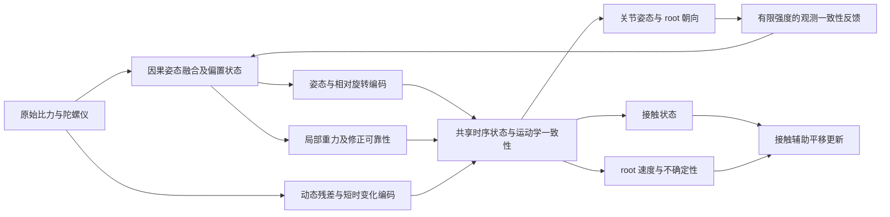

# 全姿态感知的重力—姿态解耦观测模型：文献、创新边界与实验路线

检索日期：2026-09-15；整理完成：2026-09-16。本文延续[接触建模调研](../research_imu_contact/imu_contact_innovation_review_2026-09-15.md)，以[现有基准报告](../benchmark_results_analysis.md)、本地论文及实现为起点，补充姿态融合、惯性里程计、可观测性与近期人体重建文献。目标是少于六个物理 IMU、移动端在线推理，以及躺卧、翻滚、爬行等非常规动作。本文提出研究假设，不报告新模型性能，也不使用康复模板、动作模板匹配或模板衍生特征。

## 1. 结论与建议定位

**方向有研究价值，但原始缺口需要修正；仅提出 orientation / gravity / dynamic / root-state 四分支，创新性偏弱。**

“许多方法把重力方向当成人体竖直方向”尚缺逐篇证据。尤其 GlobalPose 已联合重建局部重力与人体姿态，BaroPoser 明确用局部重力区分站立与躺卧。不能把重力对齐坐标、站立标定、准静态加速度假设、训练数据中的站姿偏好混为一个假设。[R1–R3]

更值得检验的问题是：**在低成本、少量 IMU 和大倾角运动下，姿态融合误差、持续动态加速度、偏置和佩戴误差如何耦合；人体重建能否识别不可信的重力证据，利用跨传感器运动学一致性限制错误修正，并在不可观测时保留不确定性？**

建议工作题目：

> **面向全倾角运动的少 IMU 人体重建：观测一致性与可靠性驱动的重力—动态加速度分解**

“全倾角”指骨盆、躯干相对重力的倾斜范围，包括侧卧、仰卧、俯卧和连续翻转；不承诺所有人体动作均可唯一恢复。若保留“解耦”，应定义为区分信号来源和误差机制，而不是强迫重力与人体姿态统计独立。

| 候选表述 | 当前评价 | 成立所需证据 |
|---|---|---|
| 四分支编码器 | 可作为实现结构，单独贡献较弱 | 同输入、同参数量、同因果窗口下优于拼接网络 |
| 增加局部重力特征，区分站躺 | 已有直接先行工作 | 不能作为首次贡献；对照 GlobalPose、BaroPoser |
| 分解重力与动态加速度 | 是长期姿态估计问题 | 超越 VQF/常规融合，说明人体稀疏观测带来的新机制 |
| 依据跨身体运动学一致性调节重力修正 | 值得优先验证的候选 | 真实原始 IMU 上降低错误修正；不能只靠更大网络或额外输入 |
| 无骨盆传感器时估计 root 倾斜并表达歧义 | 难度较高，有明确应用价值 | 与有骨盆设置分开；证明少传感器和非常规姿态收益 |
| 重力模块独立解决平移漂移、穿地和接触滑动 | 不成立 | 仍需速度、接触、地面几何等约束；不能由重力方向推出位置 |

## 2. 先把物理问题说准确

### 2.1 加速度计测量的是比力

令世界系为 W，传感器系为 S，骨盆/root 系为 B；`R_WS` 把 S 中向量转到 W。设世界重力 `g_W = g0 u_W`，`u_W` 为向下单位向量，`g0≈9.81 m/s²`。则：

\[
f_S=R_{WS}^{T}(a_W-g_W)+b_a+n_a,
\qquad
\omega_S^m=\omega_S+b_\omega+n_\omega.
\]

这里 `a_W` 是传感器所在点的世界线加速度，不一定等于骨盆或质心加速度；`f_S` 是原始加速度计比力。采用上述符号时，静止传感器有 `f_S≈-R_WS^T g_W`，恢复线加速度为：

\[
a_W=R_{WS}(f_S-b_a)+g_W.
\]

“原始加速度含重力”是常见口头表述，但写代码或损失时必须明确符号、坐标、单位以及是否已去重力。本文公式与 Mahony 文献说明、PNP/GlobalPose 原生处理的基本关系一致；不同 SDK 的轴定义及数值符号仍需单独核对。[R2、R7；C3–C4]

### 2.2 必须区分三个方向

| 量 | 物理含义 | 能提供什么 |
|---|---|---|
| `u_W` | 世界中的重力方向 | 建立水平/竖直基准；固定世界系下通常是常量 |
| `d_S=R_WS^T u_W` | 重力在传感器坐标中的方向 | 限制传感器倾斜的两个自由度；不能单独决定航向 |
| `d_B=R_WB^T u_W` | 重力在骨盆/root 坐标中的方向 | 描述身体相对重力的倾斜；不等于人体长轴或完整局部关节姿态 |

静态、外参已知且 IMU 固定在骨盆上时，重力通常确实能区分骨盆直立与平躺的倾斜。它不能独立确定重力轴周围的旋转，也不能确定未观测关节。IMU 若位于手腕或大腿，局部关节运动又会改变传感器与骨盆的相对朝向，不能把该传感器姿态直接当成 root 姿态。

因此，“躺卧时重力不能决定完整朝向”是对的；“躺卧时重力不再含有效姿态信息”是不对的。

### 2.3 低频不等于重力，高频不等于运动

低通原始 `f_S` 估计重力只在一定运动条件下近似成立：持续平移加速度可以是低频，匀速转动可产生持续向心加速度，翻滚又会使 `d_S` 随时间快速改变。传感器坐标下固定低通会同时混入运动分量和引入重力方向滞后。

一个说明性反例：水平持续加速度为 `0.2g` 时，直接把比力方向视为竖直方向，会产生约 `atan(0.2)=11.3°` 的假倾斜，但比力模长仅从 `g` 变为 `sqrt(1.04)g≈1.020g`。所以“模长接近 g”不能充分证明重力观测可靠。这是理想化计算，不是本项目实测误差。

VQF 已在近惯性坐标中滤波加速度，而不是简单地在不断旋转的传感器坐标中固定低通。将低频分支改成“陀螺仪传播＋自适应倾斜修正”更加合理，但这一步本身也已有成熟先例。[R8]

### 2.4 融合姿态与 gravity branch 通常不是独立信息

消费设备的 orientation 往往已经由加速度计、陀螺仪及可能的磁力计融合得到。若再计算 `d_S=R_WS^T u_W`，gravity branch 是同一个 orientation 的确定性变换：它可以改善特征表达，却没有增加独立观测。

若同时输入 raw acc、gyro、SDK quaternion 和 SDK gravity，几路信号也可能共享同一噪声与历史滤波状态。把它们作为独立观测相乘概率或重复滤波更新，可能过度自信。应追踪共同来源，在统一观测模型中融合，或至少对相关误差做实证校准。

### 2.5 无法靠网络结构取消不可观测性

没有可信航向参考时，重力不能提供绝对 yaw。没有外部位置锚点或有效接触/速度条件时，IMU 也不能唯一确定绝对平移和初始速度。允许任意未知 `a_W` 时，单个比力观测不能唯一拆成倾斜、动态加速度和加速度计偏置。

运动学链能增加约束，但约束是否足够依赖运动激励、几何外参以及哪些部位被观测。Kok 等给出了运动学链相对朝向的可观测条件，并明确不需要把加速度计假定为只测重力；其结论不能直接升级成“三个 IMU 足以唯一恢复所有人体关节”。[R12] 接触辅助滤波的绝对位置/yaw 局限也需在各自系统假设下解释。[R19]

## 3. 原始缺口如何改写

| 容易混淆的现象 | 是否等于“强制人体直立” | 本研究应核查的机制 |
|---|---|---|
| 将世界系竖直轴与重力对齐 | 否，是坐标约定 | 是否同步变换所有向量、朝向、地面与输出 |
| 以骨盆 IMU 为局部参考并去除全局旋转 | 否，但可能丢掉身体相对重力的上下文 | 是否保留 `d_B` 或骨盆世界朝向；GlobalPose 已专门处理 |
| 标定要求 T-pose/站立 | 否，不等于运行期只能站立 | 躺卧冷启动是否必须先完成标定；外参与初始姿态是否混用 |
| 融合器把加速度方向用于倾斜修正 | 依赖动态加速度假设，不依赖人体站姿 | 快速翻滚或持续加速时修正是否错误 |
| 训练数据多为直立活动 | 可能形成统计偏好，但需实验 | 同观测噪声、同接触条件下，倾角分组误差是否系统变化 |
| root 速度只依赖双脚接触 | 是接触/运动约束问题 | 躺卧、爬行时应与前一份接触研究联动 |

可直接用于研究计划的缺口陈述：

> 现有稀疏 IMU 重建已利用局部重力、姿态先验与非惯性运动补偿，但在真实低成本原始观测、少于六个传感器及大倾角连续运动下，重力修正的可靠性、相关融合误差和缺失 root 观测之间的关系仍需系统检验。本研究拟构建受运动学观测一致性约束的因果估计器，在可靠区间利用重力修正倾斜，在动态混淆或观测不足时抑制错误修正，并保持 root 与关节估计的一致性。

这是本次证据范围内提出的可检验空白，不能写成“此前没有任何方法考虑”。

## 4. 最接近的三篇人体重建工作

### 4.1 GlobalPose：与原方案最直接重叠

Yi、Pan 与 Xu（2025）的 GlobalPose 使用六 IMU。§3.1.1–3.1.2 明确提出：

> “model the joint prior distribution of root-frame gravity direction and local pose”

其初始局部重力由骨盆 IMU 朝向得到：

\[
g''=(R_{root}'')^T g_M.
\]

网络在预测叶节点位置、全关节位置的过程中逐步修正局部重力，再通过重力向量对齐修正 root 的倾斜并重新表达输入。它不是把骨盆轴强行拉回竖直；单一重力对齐也不能恢复绝对航向。[R1，§3.1]

§3.2 将 root 速度分成平行和垂直重力的两部分，以身体倾斜作为速度先验条件。原文举例：躺着的人与站着的人，即使局部姿态相同，运动自由度的统计分布也不同。这恰好说明它知道“躺卧”和“直立”的区别。

§4.3 还指出：在其消融设置中，仅输入噪声重力而不重建，往往不如不输入；联合重力修正效果更好。这已经触及“重力特征可靠性”的问题，限制了只添加 attention/gate 的新颖性。附录 A 又将 root 角速度和加速度输入首个 LSTM，以隐式学习非惯性加速度补偿。

**真正可进一步问的问题：**这种倾角—姿态/速度联合先验在低覆盖的翻滚、躺卧滑动中是否过强？移除骨盆传感器后如何得到可靠的 root 重力？能否借助原始观测一致性区分传感器倾斜错误和真实少见姿态？这些都尚须新实验，不能把可能偏差当成该论文已证实的缺陷。

### 4.2 PNP：dynamic branch 已有物理化先例

PNP（2024）使用六 IMU，在非惯性 root 坐标系中建模虚拟加速度。其核心包含 root 平移、离心、科里奥利和欧拉项：

\[
a_{fic}=-\big(a_{RR}+[\omega_{RR}]_\times^2p_{RL}
+2[\omega_{RR}]_\times\dot p_{RL}
+[\dot\omega_{RR}]_\times p_{RL}\big).
\]

利用 root 加速度、角速度、角加速度和历史叶节点位置/速度进行估计，再用修正后的局部加速度重建姿态。该公式适用于一般转动参考系，没有站立前提。全局运动分支在惯性世界系中建模，不需要重复施加非惯性补偿。[R2，§3.1]

PNP 还合成高采样率原始加速度、陀螺仪和磁力计数据，加入噪声并通过融合器得到 orientation；因此“从 raw IMU 生成真实噪声训练”也不能单独称新。[R2，§3.2]

**对本方案的要求：**dynamic branch 必须明确额外解决什么。若仅输入线加速度、gyro、短时差分，并声称补偿躺卧/翻滚中的动态干扰，与 PNP/GlobalPose 的差别不够清楚。

### 4.3 BaroPoser：少传感器、局部重力与 root 已结合

BaroPoser（UIST 2025）使用左腕手表与右侧裤袋手机两台设备，并额外使用气压计。它以右侧裤袋传感器为参考系，不把大腿/手机姿态直接等同于骨盆姿态。§3.2 的 22 维输入已经包括：两路局部加速度、相对旋转、参考传感器角速度、局部重力与相对高度。[R3]

\[
g_{local}=R_{rp}^{T}g,
\qquad
\omega_{rp,t}=\mathrm{Log}(R_{rp,t-1}^{T}R_{rp,t})/\Delta t.
\]

原文明确写局部重力：

> “can be used to distinguish between poses such as standing and lying”

§3.3 将水平 root 速度预测与气压高度变化结合，并减去由腿部局部运动造成的高度变化。因此“orientation＋gravity＋dynamic＋root”在信息组成上已经很接近其方案；改成四个编码器并不会自动形成新问题。

比较时必须把它标成 **IMU＋barometer**。其 §4.1 说明若干公开数据集评测使用真实 IMU、合成高度，同时另做真实 IMU/气压采集；不能将所有高度辅助结果都视为真实气压实测，更不能放进纯 IMU 等信息量主表。

## 5. 扩展文献：本方向还需要跨越哪些已有工作

| 文献 | 已核实机制 | 对创新定位的影响 | 阅读边界 |
|---|---|---|---|
| DIP，2018 [R4] | 六 IMU 的学习式稀疏人体姿态重建 | 稀疏推断依赖训练先验；不能把未观测关节当成直接测量 | 本地论文与相关输入实现 |
| TransPose，2021 [R5] | 局部姿态、root 速度与接触融合；实际代码保留骨盆世界朝向 | root 局部化不代表所有重力信息被丢弃；骨盆参考计入物理传感器数 | 本地论文、live/net 输入路径 |
| MobilePoser，2024 [R6] | 消费设备少传感器重建与手机部署 | 少 IMU/手机实时是已有目标；新模块要有额外精度—成本收益 | 本地论文；本地修改版不能等同原论文 |
| Mahony 等，2008 [R7] | SO(3) 互补观测器、在线 gyro bias；嵌入式实现 | 一般姿态几何、融合与偏置估计不是新问题；没有人体直立前提 | ANU 作者机构条目摘要＋AHRS 实现说明，未全文重推证明 |
| VQF，2023 [R8] | 近惯性坐标加速度滤波；静止/运动偏置估计；磁干扰抑制；在线与离线版本 | 必须设置强融合基线；不能只战胜 naive low-pass | 论文摘要、发表元数据、作者实现/API；HTML 全文接口 404 |
| IDOL，AAAI 2021 [R9] | RNN＋EKF 姿态估计，再将原始 IMU 转换坐标供定位网络使用 | “姿态误差影响位移，所以联合改进两阶段”已有直接先例 | 原文摘要与方法段；对象是手机里程计，不是全身重建 |
| LGC-Net，2022 [R10] | 轻量 gyro 动态补偿；深度可分离卷积与时间特征；姿态估计 | 轻量可学习 bias/dynamics 前端已有；需证明人体场景特有收益 | 摘要与原文方法定位；EuRoC/TUM-VI 结果不能替代手机人体测试 |
| EqNIO，2024 [R11] | 保持重力的旋转/反射对称；学习规范坐标；位移和协方差共同变换 | “重力对齐＋等变性＋不确定性”并非空白；也提醒不能误用全 SO(3) 不变性 | v3 摘要、问题设置及规范坐标方法 |
| Kok 等，2022 [R12] | 运动学链相对朝向可观测性；以激励指标识别退化区间 | 可借鉴约束可靠性，但仅用角速度大小不足以证明可观测 | 原文问题、定理条件与讨论；不直接套到缺测人体关节 |
| Complete Inertial Pose Dataset，2022 [R13] | 原始 MARG、标定、融合至人体姿态的全链路数据 | 有助于验证原始观测，而不仅是已处理的 orientation/acc | 摘要；非常规动作覆盖、许可与 GT 独立性仍需数据审计 |
| Deep Inertial Pose，2025 [R14] | 学习网络与 Madgwick 混合；比较 feedback 与 detached 状态路线 | “神经编码器＋经典融合”也已有；注意它不是 2018 年 DIP | 已查摘要与方法/结果段；摘要与结果段最佳模型名称存在不一致，不引用其数字作排名 |
| MagShield，ICCV 2025 [R15] | 联合检测磁干扰并用运动先验修正 | 泛化的磁干扰检测/可靠性 gate 不能称首次 | CVF 官方摘要，沿用上一轮已核实材料 |
| ProbIP，ICCV 2025 [R16] | 旋转概率分布、不确定性与渐进分布收窄 | “uncertainty-aware 稀疏 IMU 重建”已经存在 | CVF 摘要；未据此断言其具体 contact/root 能力 |
| Transformer IMU Calibrator，2025 [R17] | 动态身体佩戴标定 | sensor-to-bone 外参适应不是空白，需与重力错误分离 | 本地作者稿首页与摘要；不在此复述未经复核的全部实验 |
| AnyMo，2026 [R18] | 物理 IMU 合成、密集表面位置与跨佩戴条件表示 | 安装朝向增强/设备无关表示有近期先例 | 新检索摘要；运动理解任务，不能等同 SMPL/root 重建 |

这些论文来自不同任务和输入协议，表格用于定位先行机制，不是性能排行榜。尤其 MARG 中包含磁力计，“6D/9D fusion”是观测通道类型，不是六个/九个身体 IMU。

## 6. 本地代码与既有 benchmark 对本方向意味着什么

### 6.1 必须先分清实际可用输入

| 路径 | 当前代码事实 | 对四分支方案的限制 |
|---|---|---|
| MobilePoser AMASS `process.py:23,103` [C1] | 网格顶点二阶差分合成世界线加速度；FK 给出骨骼世界旋转；没有把重力加入 `acc` | 不能低通这个 `acc` 得到重力；`ori` 不是经历噪声融合的原始设备输出 |
| MobilePoser `data.py:63–76` [C2] | 取前五槽；线加速度缩放后与世界旋转拼接；此处没有独立 gyro，也没有骨盆相对归一化 | 不能直接指控这个路径把 root 强制直立；物理 IMU 数与槽数要审计 |
| MobilePoser DIP/手机接收 [C1、C7] | 读取保存的 `imu_acc/imu_ori` 或发送端 acc/quaternion | 仅靠字段名不能断言是 raw acc、userAcceleration 或哪种姿态融合 |
| PNP 原生 TotalCapture [C3] | 使用 raw acc/gyro/mag；转换成世界线加速度后输入模型 | 借用该路径时应保留单位、外参和时间戳；gyro 不应随意由融合旋转替代 |
| GlobalPose 原生测试/合成 [C4] | 原始比力与重力转换关系显式；合成可调用姿态融合 | 更接近本研究所需数据管线；不同合成模式必须记录 |
| GlobalPose `net.py` [C5] | `gR0=-R[5,1]` 取 root 局部重力；预测重力后修正 root | 已有 gravity reconstruction，不能当作“无重力”基线 |

若只有理想 `a_W` 与正确 `R_WS`，可以生成理想比力 `f_S=R_WS^T(a_W-g_W)`。但这不能找回处理时丢失的真实偏置、融合误差、频谱与原始 gyro。AMASS 的 bone rotation 还需加 sensor-to-bone 外参，才能成为传感器朝向。由朝向差分得到的角速度应标注为合成/派生信号。

### 6.2 发现一个与本次问题直接相关的桥接风险

当前 [GlobalPose/evaluate_bridge.py](../GlobalPose/evaluate_bridge.py) 中 `_to_globalpose_inputs` 执行 `aM=acc/30+g`，注释假定输入已乘 30。但共享 [bridge_data.py](../benchmarks/bridge_data.py) 直接读取并转为 float，MobilePoser AMASS 保存的顶点加速度本身按帧率平方计算为线加速度，没有对应的乘 30。GlobalPose 原生 [test.py](../GlobalPose/test.py) 则将 `R·f+g` 作为线加速度输入。

因此在“当前共享 AMASS 保存文件直接进入该 bridge”的路径上，存在**缩放和重力语义不一致**。同样，[PNP/evaluate_dip.py](../PNP/evaluate_dip.py) 对注释中已去重力的 `acc` 再加 `g`，也应与原生接口核对。静态 `a_W=0` 被人为变成 `g`，再随着身体姿态转入局部系，可能产生虚假的姿态相关信号。

这是当前源码中的接口诊断，不是历史服务器结果原因的确认。历史数据可能经过其他预处理、使用原生 DIP 分支或不同版本；需对照实际命令、数据文件、checkpoint 和服务器代码。此次只记录，不修改模型、适配器或旧报告。

### 6.3 现有结果不能证明“重力混淆造成躺卧失败”

历史报告有 lying 5 条、crawling 13 条，没有独立 rolling 行；缺少重力角误差、root tilt/heading 分解、原始融合残差与不同倾角的校准分析。它支持继续诊断，非常不足以确认单一物理原因。

此前报告还指出 DIP 平移标签路径置零、30/60 Hz 对齐、初始化/GT 和物理回退等问题。这些都可能改变现象。不能把已去重力的理想 AMASS 测试解释成“验证了真实加速度计中的重力分离”。

## 7. 建议的技术路线：三类观测＋一个耦合状态估计器

四分支可以保留，但 root-state 应定位为状态融合/解码模块，它没有额外传感器观测。不要把四路画成四个相互独立的信息源。

这是候选设计图，不是已实现或已证明优于先行工作的系统。

### 7.1 Orientation branch

输入每个物理 IMU 的姿态、相对旋转/时间增量、有效性 mask、融合器的可用诊断量。使用 rotation matrix、quaternion 或连续 6D 表示；避免以 Euler 角作为主要回归量。

输出姿态表征与小幅修正候选，并区分倾斜误差和航向误差。磁力计可选：若使用，明确记为额外观测模态并评测磁干扰；纯 acc＋gyro 设置不假装拥有绝对 heading。

基线先用冻结的同一因果融合器，不在第一步同时学习所有偏置、外参和人体状态。否则改善来自哪里很难判定。

### 7.2 Gravity branch：估计方向与“能否修正”

输出 `d_S∈S²` 与误差尺度/修正可靠性。可以由 gyro 传播历史重力，再用经过动态补偿的比力修正：

\[
d_{S,t}^{-}=\operatorname{Exp}(-[\omega^m_{S,t}-\hat b_{\omega,t}]_\times\Delta t)d_{S,t-1}.
\]

该式是局部离散传播近似，需与实际 gyro 时间区间约定一致；它不是独立创新。新的研究内容应在**修正条件**：当前比力偏离预测重力，究竟来自真实动态加速度，还是倾斜漂移？

可靠性输入可包含融合 innovation、gyro 传播一致性、短时历史、跨传感器运动学残差、缺测和偏置状态。`|‖f‖-g|` 与 `‖ω‖` 只能作为特征，不能硬定义可信/不可信。输出最好表达连续误差尺度，评估校准度，而非只展示注意力热图。

若 gravity branch 的输入只有 `R_WS^T u_W`，应诚实命名为“局部重力特征/重建”，而非“从原始加速度分离重力”。

### 7.3 Dynamic branch：约束动态来源，而非把高通当真值

输入 raw `f_S`、gyro、因果时间变化及姿态传播后的残差。可预测传感器点的线加速度候选 `a_W^kin`，并与人体姿态/root 状态保持运动学一致，而不是直接给网络一个完全自由的加速度变量。

候选一致性残差为：

\[
r_{f,i}=f_{S,i}-\hat b_{a,i}-\hat R_{WS,i}^{T}\hat a_{W,i}^{kin}+g_0\hat d_{S,i}.
\]

其中 `a_W,i^kin` 要由对应传感器点轨迹及明确外参得到，包含身体转动和关节运动；用关节中心或 root 加速度代替会遗漏杠杆臂效应。窗口差分必须明确是否因果；离线中心差分可以用于训练标签，不能隐蔽地出现在在线输入中。

还需满足：

\[
r_{d,i}=\hat d_{S,i}-\hat R_{WS,i}^{T}u_W.
\]

如果 orientation 与 gravity 共享同一个状态，该关系可直接构造满足；若两个头独立预测，则用软一致性约束。**仅最小化 `r_f` 不够**：任意错误倾斜可被自由 `a_W` 或 bias 抵消。必须结合独立姿态/轨迹监督、外参校准、偏置时间尺度与多传感器约束，并用扰动实验验证可辨识区间。

这些方程是标准测量关系的组织方式。新颖性必须落在稀疏人体条件下的约束设计、可靠性估计和证据，而不是称它们为新物理定律。

### 7.4 Root-state decoder：明确参考传感器与骨盆的区别

状态可包含 `R_WB∈SO(3)`、root 速度、相对平移、关节姿态、接触状态和受控规模的不确定性。

有骨盆 IMU 时，已知外参可给 root 朝向直接观测；主要问题是误差修正。无骨盆 IMU 时，需要推断参考传感器与骨盆之间的朝向：

\[
R_{WB}=R_{WS_{ref}}R_{BS_{ref}}^{T}.
\]

这里 `R_BSref` 把参考传感器向量转到骨盆系，若传感器位于手腕或大腿，它依赖关节状态和佩戴外参，并非固定可知。不能隐式使用 GT pelvis 作为归一化后，宣称无骨盆传感器推理。

root 平移先以速度积分加接触校正实现，不在首版加入昂贵全身动力学求解。即使重力估计完美，也需要处理后背/膝/肘接触、滑动和支撑转换。低可信状态应减弱修正并保留不确定性，不能把“无法观测”变成“强制静止”。

## 8. 三个更具体的候选贡献

### A. 运动学一致性驱动的重力更新有效性估计——优先验证

研究问题：在相同 raw IMU 与融合前端下，跨身体的运动学残差能否识别“动态加速度被误认为倾斜”的区间，降低 root 倾斜错误，且不延迟真实翻滚？

候选机制是基于因果人体状态和多传感器残差，调节倾斜更新方向/强度，并把误差尺度传入人体解码器。相较 VQF 要体现稀疏人体约束的额外价值；相较 GlobalPose 要体现对原始观测错误与罕见但真实姿态的区分，而不只是再学一个姿态先验。

失败判据：只能胜过低通、不能胜过 VQF；只改善 AMASS 理想数据；或通过更强平滑得到低误差但翻滚响应显著滞后。出现这些结果时不应继续扩张四分支。

### B. 缺失骨盆观测下，按可观测程度更新 root 倾斜——第二阶段

研究问题：使用 3–5 个物理 IMU 时，哪种布局与运动片段足以支持 root 倾斜更新，什么时候只能依赖先验？

需要区分可观测性理论与经验可靠性。可以借鉴 Kok 等的运动学链激励分析，但人体缺测、多关节与偏置会改变状态维度和 Jacobian；若没有完整推导，就将输出称为经验置信度，不能直接宣称“可观测性保证”。

评测有骨盆/无骨盆两条路线；同样数量下比较 pelvis、thigh、trunk 的替代价值。无骨盆且静态肢体配置歧义大时，允许更大误差区间，不能用模板把结果固定为站姿。

### C. 保持物理语义的倾角鲁棒训练——配套贡献

研究问题：能否区分安装坐标变化、世界坐标变化和真实身体倾斜，使合成训练覆盖非常规运动而不引入伪物理？

三种变换不能混用：

1. **世界坐标重表达：**同时变换 `R、p、a、g` 和地面。物理动作不变，传感器本体系 raw 测量应保持一致。这检验坐标一致性。
2. **固定地面/重力下改变身体倾斜：**是真正不同的物理运动，接触、轨迹和比力必须重新计算。不能任意把站立动作 pitch/roll 旋转后仍保留原接触标签。
3. **传感器安装坐标变化：**一致变换 raw 向量、姿态和 sensor-to-bone 外参；仅改变方向不等于在身体表面改变位置，后者还会改变旋转加速度。

水平平面场景中绕重力方向的全局旋转通常是较自然的增强对称；完整 SO(3) 的坐标等变不等于固定重力下的物理运动不变。EqNIO 已研究保持重力的对称群，不能将一般 equivariance 单独包装为新贡献。[R11] 合成与佩戴增强还需对照 PNP、TIC、AnyMo。[R2、R17–R18]

## 9. 最小实验：先证明问题，再决定是否训练复杂模型

### 9.1 第零步：输入契约审计

每份数据记录采样率、原始/重采样时间戳、acc 单位与语义、gyro 单位及坐标、旋转矩阵方向、轴定义、外参、磁力计使用、融合器版本、滤波延迟、初始姿态来源。

先做四个简单数值检查：静止时 raw 比力模长约 g、线加速度约零；纯坐标重表达后的重建一致；已知旋转下 gyro 符号一致；积分时间尺度一致。把 bridge 和原生入口输入到同一模型的张量语义对齐，再解释历史方法差异。

这些是建议执行的后续检查，此次没有运行服务器或修改适配器。

### 9.2 误差归因矩阵：分别替换重力和姿态

| 设置 | 固定内容 | 诊断的问题 |
|---|---|---|
| 原有输入/模型 | checkpoint、动作、采样率 | 起点 |
| 只给理想重力特征 | 尽量固定其余观测与骨干 | 错误重力上下文是否是瓶颈？ |
| 只给理想 IMU orientation，并同步重算依赖它的线加速度 | 其他 raw 测量/协议不变 | 姿态融合误差占多少？ |
| 理想倾斜、保留估计航向 | 关节信息与接触保持相同 | tilt 与 heading 的影响能否区分？ |
| 理想传感器朝向/重力，仍然稀疏输入 | 不使用 GT 未观测关节 | 剩余误差是否主要来自稀疏歧义/先验？ |
| 仅 oracle contact | 保持估计姿态 | 地面 root 问题有多少来自接触？ |
| oracle orientation＋contact | 分别标注两种额外信息 | 诊断相互作用，不进入正常方法主表 |

注意：在几何上绑定 gravity 与 orientation 的模型中，“只替换 gravity”会故意制造不一致。它只能是接口敏感性诊断，不能当作可部署方法；需另做满足 `d=R^T u` 的倾斜修正实验。对冻结模型注入 GT 也可能造成输入分布变化；重要结论应用受控重训练复核。

如果 ideal orientation/gravity 几乎不改善 lying/rolling 姿态，而 oracle contact 明显降低 root 误差，优先推进接触方向；反之再投入观测前端。不能仅凭“看起来像重力错了”立项。

### 9.3 模型消融：排除分支数与输入信息量的混淆

| 编号 | 对照 | 必须公平控制 |
|---|---|---|
| B0 | 同 raw 输入、同融合器的单编码器 | 参数量、隐状态、历史窗口、训练数据 |
| B1 | B0＋局部重力特征 | 不额外加入 GT root 或物理传感器 |
| B2 | 四分支后直接 concat | 相同总参数/计算预算；检验结构拆分本身 |
| B3 | VQF 在线前端＋B0/B2 | 所有 raw 通道相同；禁止离线 VQF 作为在线基线 |
| B4 | GlobalPose 式重力联合重建的受控基线 | 六 IMU 原版分表；少 IMU 变体需明确为重训适配版 |
| B5 | PNP 式动态/非惯性补偿 | 补偿目标、坐标和输入时间基一致 |
| B6 | B2＋观测一致性 | 不使用额外的未来帧/GT 动态输入 |
| B7 | B6＋可靠性更新与不确定性 | 同数据监督，检查校准而不只均值误差 |
| B8 | 固定接触模块下比较 B0–B7 | 隔离重力模块收益；随后再比较模块组合 |

如果新方案使用 gyro，而旧基线只用 acc＋ori，应增加一个同样得到 gyro 的基线，不能把增加信息的收益全部归因于解耦。同理，相同物理 IMU 的磁力计、气压计是否参与也要单列。

### 9.4 必须覆盖的动作与扰动

| 测试组 | 动作或条件 | 要暴露的问题 |
|---|---|---|
| 静态倾角 | 站立、仰卧、俯卧、左右侧卧；多个关节配置 | 是否把人体轴强行竖直；静态缺测歧义 |
| 冷启动 | 已知外参但躺卧启动；另测外参未知 | 区分姿态初始化与标定难题，不把 GT 首帧混入 |
| 连续倾角变化 | 站—坐—躺、反向起身、慢/快侧滚、多次滚转 | 倾斜响应、符号翻转、滤波滞后、跨 180° 稳定性 |
| 重力—运动混淆 | 持续平移加速、摆臂、向心加速度、碰撞 | 低频动态与高频重力变化是否被错误分离 |
| 支撑与真实位移 | 手膝爬、肘膝爬、躺卧四肢运动、地面滑动 | 躺卧不等于静止；重力前端不能替代接触建模 |
| 传感器扰动 | gyro bias、acc bias、安装角偏差、磁干扰、时间不同步 | 哪个误差源主导，修正是否过度自信 |
| 观测稀疏 | 同数量有/无骨盆；缺包与 sensor mask | 布局、参考选择与鲁棒性 |

先单因素扰动，再组合；幅值分布应由目标设备实测估计，不能只加方便的独立高斯噪声。可用旋转台/刚体试验先隔离融合器误差，但它不能替代人体非常规动作验证。

### 9.5 指标与数据划分

应同时报告：

- **重力与姿态：**每传感器 `acos(clamp(d_pred·d_GT))`；root 的 SO(3) 角误差；root 倾斜误差 `acos((R_pred^T u_W)·(R_GT^T u_W))`；航向误差另列。
- **人体重建：**root 对齐关节误差与世界系关节误差同时给出，避免对齐隐藏 root 错误；按动作和倾角报告中位数、P90/P95。
- **动态与时序：**合成数据上的线加速度分解误差；真实数据上若无可信加速度 GT，就报告独立轨迹一致性与其局限；滚转延迟、过冲、重置次数。
- **root 与接触：**相对轨迹误差/漂移、非足表面穿透、接触滑移、支撑转换尖峰；真实滑动不应因“速度非零”被自动判错。
- **可靠性：**角误差置信区间覆盖、risk–coverage 曲线、错误高置信修正率；概率目标配合防止任意增大方差的训练项。
- **成本：**全链路参数量、模型文件、手机 CPU/NPU 延迟 P50/P95、峰值内存、持续运行功耗，以及融合/窗口引入的算法延迟。

全倾角下避免直接使用存在奇异性的 Euler yaw：可先以统一约定对齐倾斜，再评估重力轴 twist，并明确 180° 对齐歧义处理；或对身体 heading 的水平投影退化区间单独标注。不能将不可定义航向误差写成零。quaternion 需处理 `q` 与 `-q` 等价；最小向量对齐在反平行方向也需要连续性/备选轴策略。

数据按受试者、原始序列和设备划分，防止同一动作切窗泄漏；对配对序列差值做统计区间，不把相关帧当成独立样本。动作名称仅用于评测分组，不作为模板检索输入。AMASS 可做受控合成实验，但真实 raw IMU、独立动捕/视频 GT 和困难动作覆盖是最终证据；DIP 原路径没有真值平移时不得评价真实轨迹准确度。

## 10. 传感器与移动端设计建议

主实验先选 3–5 个物理 IMU，六 IMU 保留为参考。布局候选包括骨盆＋双腕、躯干/大腿＋双腕、双腕＋双腿等；它们是待比较方案，不是已知最优布局。应区分总佩戴数、标定所需数、在线输入数，尤其不能在线删掉骨盆张量却仍用其朝向做预处理。

为了适应手机算力，四个分支可实现为共享小型时序骨干前的几组轻量投影/状态，不必四套大型 Transformer。优先使用小 GRU/TCN 和有限维度的滤波状态；是否需要完整跨传感器协方差应由误差相关性证据决定，不应一开始就增加高维全身滤波器。

部署预算必须来自目标手机测量。60 Hz 的帧间隔约 16.7 ms，30 Hz 约 33.3 ms，但这不等于可以把全部时间留给网络：还需采集同步、融合、数据搬运与渲染。推理吞吐高也不能抵消长低通窗口的动作延迟。INT8/FP16 可用于神经部分评估，旋转归一化、滤波与矩阵运算需要另做数值稳定性检查；VQF 官方实现还提醒其 Butterworth 滤波部分存在精度要求。[R8]

## 11. 与上一份接触方向如何选择和组合

| 维度 | 本次观测/重力方向 | 上次接触方向 |
|---|---|---|
| 主要作用位置 | 原始观测、传感器倾斜、关节/root 朝向 | root 速度/高度、非足接触、滑动与支撑转换 |
| 最接近先行工作 | GlobalPose、PNP、VQF、BaroPoser | TIP、PIP、GlobalPose |
| 最关键数据 | 真 raw acc/gyro、可靠姿态/外参 GT | 可靠轨迹、表面接触/地面 GT |
| 用现有 AMASS 的可验证程度 | 能测表征与受控噪声，不能证明真实重力分离 | 能测运动学接触上限，但接触/承重真值仍有限 |
| 首个诊断 | oracle orientation/gravity | oracle contact 与接触模式 |
| 不可替代的局限 | 重力方向不给平移和无滑动条件 | 正确接触不能完全补救严重传感器朝向错误 |

建议不要立即合成一个很大的“全姿态、全接触、全不确定性”系统。先做 `观测修正开/关 × 接触修正开/关` 的 2×2 配对消融：仅前端、仅接触、两者组合、均不启用。保持同一姿态骨干和训练条件，才看得出是否互补。

如果真实数据中姿态融合错误明显、oracle 倾斜收益大，本方向适合作为主贡献，接触作为 root 验证环节。如果理想倾斜下主要仍是漂移和支撑切换问题，优先接触主线，本方向作为可靠的输入前端即可。

## 12. 审稿人最可能提出的质疑

1. **“GlobalPose 已经做了重力重建，你的新点是什么？”** 需要回答具体的 raw 观测混淆、相关误差与约束有效性机制，并在同等输入/预算下比较；分支命名不能回答这个问题。
2. **“VQF 换上去就够了吧？”** 用冻结 VQF＋相同人体网络、简单 learned gate、完整一致性机制逐层比较。若没有额外收益，接受研究假设不成立。
3. **“你把少见动作平滑成常见动作了。”** 除均值误差，报告真实翻滚时的响应、运动幅度和错误修正；加入静躺移动四肢与真实滑动反例。
4. **“你声称无骨盆，但归一化用到了骨盆真值。”** 公布每一步物理传感器与标定依赖，独立检查首帧 GT 和参考坐标生成。
5. **“自监督分解是否只是相互抵消？”** 展示倾斜/动态/bias 各项独立误差或可观测条件；仅 raw 重建 loss 小不足以证明正确分解。
6. **“你证明的是合成数据和更大网络。”** 增加真实设备、跨设备/受试者测试、同参数基线与手机全链路成本；不能拿服务器含渲染时长代替手机 latency。

## 13. 来源、核验深度与可追溯记录

这是定向文献综述，不是 PRISMA 系统性综述。检索截至 2026-09-15，使用本地论文、arXiv 检索/摘要/可用 HTML、作者官方文档、机构仓储，以及上一轮核实的 CVF 官方摘要。关键词包括 `inertial gravity human pose`、`gravity acceleration decoupling inertial`、`inertial orientation learning`、`VQF`、`EqNIO`。检索结果先按任务和观测机制筛选，不把仅含关键词的识别/视觉任务都列为重建基线。

新网页的带 URL 文本保存在 [sources/](sources/)，本地论文转换文本沿用 [contact/sources/](../research_imu_contact/sources/)。抓取成功只代表可访问，不代表已全文审阅；下表明确标注使用范围。VQF 的 arXiv HTML 请求返回 404，结论基于摘要与作者实现文档，未冒称读过完整 PDF。对新颖性的判断限于本次检索，不保证穷尽 2026 年所有工作。

### 13.1 参考文献

| 编号 | 文献与原始入口 | 本文使用的证据范围 |
|---|---|---|
| R1 | Yi, X., Pan, S., & Xu, F. (2025). *Improving Global Motion Estimation in Sparse IMU-based Motion Capture with Physics*. [arXiv:2505.05010](https://arxiv.org/abs/2505.05010)；[本地原文](../../papers/25_GlobalPose_SIGGRAPH2025.pdf) | §3.1–3.4、§4.3、附录 A；直接先行工作 |
| R2 | Yi, X., Zhou, Y., & Xu, F. (2024). *Physical Non-inertial Poser (PNP): Modeling Non-inertial Effects in Sparse-inertial Human Motion Capture*. [arXiv:2404.19619](https://arxiv.org/abs/2404.19619)；[本地原文](../../papers/16_PNP_SIGGRAPH2024.pdf) | §3.1–3.2；非惯性模型和原始数据合成 |
| R3 | Zhang, L., Yi, X., & Xu, F. (2025). *BaroPoser: Real-time Human Motion Tracking from IMUs and Barometers in Everyday Devices*. UIST. [arXiv:2508.03313](https://arxiv.org/abs/2508.03313)；[本地原文](../../papers/27_BaroPoser_UIST2025.pdf) | §3.2–3.3、§4.1；局部重力、输入与高度来源 |
| R4 | Huang, Y., Kaufmann, M., Aksan, E., Black, M. J., Hilliges, O., & Pons-Moll, G. (2018). *Deep Inertial Poser: Learning to Reconstruct Human Pose from Sparse Inertial Measurements in Real Time*. ACM TOG. [arXiv:1810.04703](https://arxiv.org/abs/1810.04703) | 稀疏学习式姿态背景；本地论文 |
| R5 | Yi, X., Zhou, Y., & Xu, F. (2021). *TransPose: Real-time 3D Human Translation and Pose Estimation with Six Inertial Sensors*. ACM TOG. [arXiv:2105.04605](https://arxiv.org/abs/2105.04605) | 局部姿态/root 分解；本地实现接口 |
| R6 | Xu, V., Gao, C., Hoffmann, H., & Ahuja, K. (2024). *MobilePoser: Real-Time Full-Body Pose Estimation and 3D Human Translation from IMUs in Mobile Consumer Devices*. UIST. [作者稿 arXiv:2504.12492](https://arxiv.org/abs/2504.12492) | 2024 发表、2025 上传作者稿；少设备与移动端先例 |
| R7 | Mahony, R., Hamel, T., & Pflimlin, J.-M. (2008). *Nonlinear Complementary Filters on the Special Orthogonal Group*. IEEE Transactions on Automatic Control. [DOI:10.1109/TAC.2008.923738](https://doi.org/10.1109/TAC.2008.923738)；[ANU](https://openresearch-repository.anu.edu.au/items/db91f02d-9a17-4ead-bc64-86ed5bc9c6f4) | 作者机构摘要；[AHRS 说明](https://ahrs.readthedocs.io/en/latest/filters/mahony.html)作实现辅助来源 |
| R8 | Laidig, D., & Seel, T. (2023). *VQF: Highly Accurate IMU Orientation Estimation with Bias Estimation and Magnetic Disturbance Rejection*. Information Fusion, 91, 187–204. [DOI](https://doi.org/10.1016/j.inffus.2022.10.014)；[arXiv](https://arxiv.org/abs/2203.17024)；[作者文档](https://vqf.readthedocs.io/en/latest/) | 论文摘要、作者文档/API；6D/9D、在线/离线版本区别 |
| R9 | Sun, S., Melamed, D., & Kitani, K. (2021). *IDOL: Inertial Deep Orientation-Estimation and Localization*. AAAI. [原文](https://arxiv.org/html/2102.04024v1) | 摘要与两阶段方法；不迁移其里程计精度数字 |
| R10 | Liu, Y., Liang, W., & Cui, J. (2022). *LGC-Net: A Lightweight Gyroscope Calibration Network for Efficient Attitude Estimation*. [arXiv:2209.08816](https://arxiv.org/abs/2209.08816) | 预印本引用；摘要与方法定位，不宣称已核实发表会场 |
| R11 | Jayanth, R. K., Xu, Y., Wang, Z., Chatzipantazis, E., Gehrig, D., & Daniilidis, K. (2024). *EqNIO: Subequivariant Neural Inertial Odometry*. [arXiv:2408.06321v3](https://arxiv.org/html/2408.06321v3) | v3 摘要、问题设置与变换机制；不混用 v1/v3 性能结论 |
| R12 | Kok, M., Eckhoff, K., Weygers, I., & Seel, T. (2022). *Observability of the relative motion from inertial data in kinematic chains*. Control Engineering Practice, 125, 105206. [DOI](https://doi.org/10.1016/j.conengprac.2022.105206)；[原文](https://arxiv.org/html/2102.02675v2) | 运动学约束、激励指标、定理条件与局限 |
| R13 | Palermo, M., Cerqueira, S., André, J., Pereira, A., & Santos, C. P. (2022). *Complete Inertial Pose Dataset: from raw measurements to pose with low-cost and high-end MARG sensors*. [arXiv:2202.06164](https://arxiv.org/abs/2202.06164) | 摘要；未检查下载后的全部动作/标注质量 |
| R14 | Cerqueira, S. M., Palermo, M., & Santos, C. P. (2025). *Deep Inertial Pose: A deep learning approach for human pose estimation*. [原文](https://arxiv.org/html/2506.06850v1) | 方法/结果段；与 2018 DIP 区分；不一致数字不用于排名 |
| R15 | Shao, Y., Yi, X., Yin, L., Guo, S., Yong, J., & Xu, F. (2025). *MagShield: Towards Better Robustness in Sparse Inertial Motion Capture Under Magnetic Disturbances*. ICCV. [CVF](https://openaccess.thecvf.com/content/ICCV2025/html/Shao_MagShield_Towards_Better_Robustness_in_Sparse_Inertial_Motion_Capture_Under_ICCV_2025_paper.html) | 官方摘要，复用已保存来源；磁干扰鲁棒性先例 |
| R16 | Kim, M., Jeon, Y., & Jo, S. (2025). *Probabilistic Inertial Poser (ProbIP): Uncertainty-aware Human Motion Modeling from Sparse Inertial Sensors*. ICCV. [CVF](https://openaccess.thecvf.com/content/ICCV2025/html/Kim_Probabilistic_Inertial_Poser_ProbIP_Uncertainty-aware_Human_Motion_Modeling_from_Sparse_ICCV_2025_paper.html) | 官方摘要；旋转概率建模先例 |
| R17 | Zuo, C., Huang, J., Jiang, X., Yao, Y., Shi, X., Cao, R., Yi, X., Xu, F., Guo, S., & Qin, Y. (2025). *Transformer IMU Calibrator: Dynamic On-body IMU Calibration for Inertial Motion Capture*. ACM TOG, 44(4). [DOI](https://doi.org/10.1145/3730937)；[本地作者稿文本](../../papersNewWay/TIC_camera_ready.txt) | 首页/摘要；动态佩戴标定先例 |
| R18 | Chen, B., Li, Z., Wongso, W., Li, L., Lin, X., Xue, H., Tag, B., & Salim, F. (2026). *AnyMo: Geometry-Aware Setup-Agnostic Modeling of Human Motion in the Wild*. [arXiv:2605.22715](https://arxiv.org/abs/2605.22715) | 新检索摘要；作为相邻表示研究，不作为重建性能基线 |
| R19 | Hartley, R., Ghaffari Jadidi, M., Grizzle, J. W., & Eustice, R. M. (2018). *Contact-Aided Invariant Extended Kalman Filtering for Legged Robot State Estimation*. [arXiv:1805.10410](https://arxiv.org/abs/1805.10410) | 复用前次理论结论核验；机器人系统假设不得直接套用人体 |
| R20 | Madgwick 算法作者资源页. [x-io: Open source IMU and AHRS algorithms](https://x-io.co.uk/open-source-imu-and-ahrs-algorithms/)；[AHRS 说明](https://ahrs.readthedocs.io/en/latest/filters/madgwick.html) | 原始报告/实现入口；不得把旧算法与新 Fusion 实现版本混作同一基线 |

### 13.2 本地代码证据索引

以下行号以本次本地快照为准，后续修改可能移动；它们用于复查输入语义，不证明历史服务器运行版本。

| 编号 | 位置 | 核查内容 |
|---|---|---|
| C1 | [process.py](../base_mobileposer/mobileposer/process.py)，`_syn_acc`、AMASS FK/保存、DIP 处理 | 无重力的合成线加速度；骨骼旋转；DIP 标签边界 |
| C2 | [data.py](../base_mobileposer/mobileposer/data.py)，`_process_file_data/_process_combo_data` | 前五槽、缩放、世界旋转拼接；没有独立 gyro |
| C3 | [PNP/test.py](../PNP/test.py)、[process.py](../PNP/process.py)、[net.py](../PNP/net.py) | raw 到世界线加速度；gyro 来源；root 参考与初始化 |
| C4 | [GlobalPose/test.py](../GlobalPose/test.py)、[simulation.py](../GlobalPose/articulate/utils/imu/simulation.py)、[imu_synthesis.py](../GlobalPose/imu_synthesis.py) | 比力方程、合成融合路径与 GT 初始化条件 |
| C5 | [GlobalPose/net.py](../GlobalPose/net.py)，`gR0` 与重力修正路径 | 显式局部重力重建；非强制竖直 |
| C6 | [TransPose/live_demo.py](../TransPose/live_demo.py)、[net.py](../TransPose/net.py) | 静态重力处理、骨盆相对输入、root 朝向 |
| C7 | [sensor_utils.py](../base_mobileposer/mobileposer/utils/sensor_utils.py) | 接收端字段不足以证明发送端原始信号定义 |
| C8 | [GlobalPose/evaluate_bridge.py](../GlobalPose/evaluate_bridge.py)、[PNP/evaluate_dip.py](../PNP/evaluate_dip.py)、[bridge_data.py](../benchmarks/bridge_data.py) | 当前桥接重力/缩放语义风险 |

**交叉核验后的边界：**GlobalPose/BaroPoser 对站躺的显式处理否定了过宽的“普遍强制直立”叙述；VQF/EqNIO/Kok 限制了把滤波、等变性、可观测性重新命名的空间；原始信号与当前 bridge 的差别限制了历史结果的因果解释。上述结论均不等于已经证明某个新方案有效。

**交付检查：**报告包含 20 项参考来源；本地链接存在性、JSON 格式、公式/代码块边界及文本编码检查通过。两项补充只读审查分别复核了 GlobalPose/PNP/BaroPoser 的原文表述，以及物理方程、当前代码语义和消融设计，未发现必须修正的实质性问题；前一项不覆盖扩展文献或历史 benchmark，后一项未运行模型。这些审查不等于所有引用已全文验证或候选方案已通过实验。

**AI 使用与局限：**本文由 AI 辅助检索、局部原文核验、代码静态检查和综合撰写；并行任务分别核对人体论文和实现，不能视为独立同行评审。没有运行新的训练/性能实验，没有验证手机部署。候选机制、数学符号、传感器外参与数据许可仍应由研究者在实施前复核；正式论文的新颖性还需扩展检索并完成同协议实验。
